# Snake Snack

Are you ready to help the snake grow and get some food to eat? 
Snake Snack is based on the classic Snake Game that so many people around the world have grown up with.
It is for every person that wants either a hit of nostalgia or just a fun easy game to play. It is on a full on responsive webside with multiple options to either play the game or maybe you want to learn about the reason behind the website, or get in contact. So why not give it a try, and get lost in the game, try and beat your own high score while listening to a good song in the background.

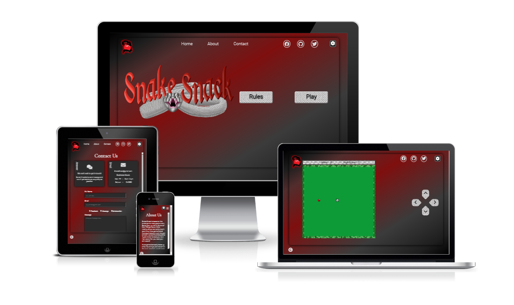 

[The Snake Snack website on GitHub Pages](https://miarasmussen05.github.io/SnakeSnack/)

## __User Stories__

- ### First Time Visitor Goals

    - I want to be able to navigate the website without any problems.
    - I want to be able to read the rules.
    - I will be able to play the snake game.
    - I will be able to learn about the creator and project.
    - I would be able to contact the creator with any inquiries.

## __Design__

### __Features__

- ### Existing Features

  - ### Navigation Bar
    - The navigation bar is showed on all pages. With only a slight difference on the game page where the page links aren't shown on bigger screens. It is fully responsive. It includes logo for snake snack that brings the user back to the home page, links to the diffrent pages - game page not included on bigger screens - social links, and a button for settings. 
    - It helps to create and easy navigations between the pages and easy acces to the settings button and social links.
    - The settings button open op a settings pop up that lets the visitor choose to turn on the music and sound effects of the website.
    - On smaller screens the navigation menu moves inside a hambuger menu with the setting and logo staying outside.

  - ### Home Page
    - The home page introduces the feel of the website. It has the hero-image that catches the eye of the visitor when they get on it, an image of a snake that is jumping out of the screen with the name Snake Snack behind it. 
    - Only the first time a visitor comes to the website there is a message that shows up on the screen. The meesages tells the visitor "Welcome to Snake Snack" and then another message "Let's get started!" that disapears after a few seconds. 
    - The working buttons of rules and play to the right of the hero image. The rules buttons have a modal box pop op on the screen that explains the rules, how to play and shows images there are in the game. The play buttons open up directly into the game when clicked. 
    - The home page as well as the navigation bar is inclosed inside a card shape that fill out most of the page with the shadow border to give the effect.
    - On smaller screens the hero images moves to fill the whole width and the buttons move under it.

  - ### Footer
    - The footer is under the card effects with a copyright icon to the left of the page. 
    - When clicked the icon goes away and the copright and disclaimer messages shows up in the center of the footer, which then goes away after 5 seconds where the copyright icon again shows up.

  - ### About Page
    - The about page have the header and two secions inside the page.
    - The first section describes what Snake Snack is and what it is based on. While the second section is about why this website was created.
    - It is fully responsive and the two section move under each other on smaller screens. 

  - ### Contact Page
    - The contact page is for the visitor that wants to get in contact with the creator.
    - The visitor can give feedback, send a message, or even write about collaborating. 
    - With two additional boxes to the right of the form the visitor will get information on respond time. As well as the email address and hours where the creator will be working.
    - In the form the visitor have to give there full name, there email address, choose a topic in the radio buttons, and give a little about what there inquiry is about. For  - To be able to push the send button all the boxes need to be answered as well as one radio button needs to be choosen. 
    - The send button then send the visitor to another page with a pop up window that needs to be clicked. Then they get a thank you that their message have been submited and with a link to go back to the home page.
    - On medium screens the two boxes jump beside each other above the form. On smaller screen they go on each other to keep it fully responsive and easy to read.

  - ### Game Page
    - The game page has the game board in the middle of the screen inside the card shape. With the clickable controls on the right side and the pause button on the left corner right next to the game. Score board above the game.
    - The game board is in a light green color to simulat grass, and the border is made up from an images that looks like a bush is inclosing the game. 
    - The score board above the game shows the score number that goes up with the food that gets eaten. It shows the hightscore of the player and saves it in their local storage.
    - The clickable buttons to the right is fully responsive with hover effects that shows they are clickable. With different colors for each of the four control buttons arrows.
    - On the game page the page links are gone and the logo is used to go back to the home page. 
    - On smaller screens the controls are moved under the game board and the game board fills out the width out the screen under the logo. The pause button stays to the bottom on the left side above the footer. 
    - When the game is over, a game over message comes to the pages with a responsive restart button instead of it showing the board.

- ### Future Features
  - A future feature could be to have high score board that saves all high scores of all players so visitors can try and beat each others scores and get to the top.
  - Levels with opsticals of different bushes so the highest levels have a whole labyrient that the player have to go back and forth in to get the food.
  - Different kinds of food to go after both healty and unhealty that takes points away.  

### __Typography and Color Scheme__

- ### Typography
  - There where used easy readable fonts. For the headings 'Cormorant' with the secondary font of sans-serif.
  - For the normal writing on all pages there where used the font of 'Roboto' with the secondary font of sans-serif, to match the headigs. The Footer got the font of 'Nunito' also with the sans-serif as its secondary font.
  - These fonts where all choosen for good readabilty and the matching between the fonts.

- ### Color Scheme
  - The color scheme for Snake Snack is made with two different color scheme. 
  - The first is a more dark color scheme for the background and different element as well as a green for the game board. This was done to give a good contrast to the green board and the silver snake.
  - The second is a light color scheme which is used for the silver colours. For the text on the pages to give a contrast from the darker background. As well as most element like the rules modal, controller buttons, restart and other buttons, and scoreboard have snake scales with silvery color in the background.

  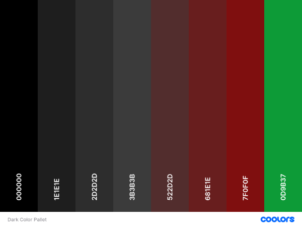

  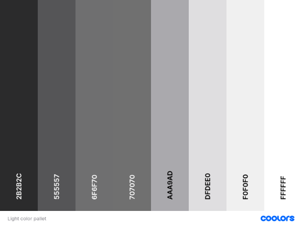

### __Wireframes__

[The Home Page - Wireframe](./readmeimages/wireframes/homewireframes.png)

[The Settings - Wireframe](./readmeimages/wireframes/settingswireframes.png)

[The Rules Modal - Wireframe](./readmeimages/wireframes/ruleswireframes.png)

[The About Page - Wireframe](./readmeimages/wireframes/aboutwireframes.png)

[The Contact Page - Wireframe](./readmeimages/wireframes/contactwireframes.png)

[The Game Page - Wireframe](./readmeimages/wireframes/gamewireframes.png)

### __Imagery__
  - All imagery on this website has been created specially for this page and game.

    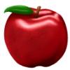
    
    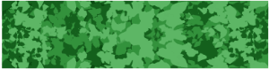
    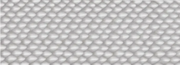
    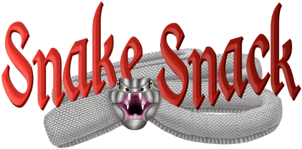

## Technology

   ### Technologies Used

   - HTML
   - CSS
   - JavaScript

   ### Programs Used

   - Git - Was used for version control, the Gitpod terminal to commit and push to GitHub.

   - [GitHub](https://github.com/) - Was used to store the project code and display the project in GitHub Pages.

   - Balsamiq - is an app that was used to create the wireframes.

   - [Comoressor](https://compressor.io/) - Was used for compressing images to a smaller size.

   - [Coolors](https://coolors.co/) - Was used for creating a pallet of the colors used.

   - [Am I Responsive?](https://ui.dev/amiresponsive?) - Was used for having an image of the website on all sizes.
   
   - [BIRME](https://www.birme.net) - Was used to changing the images from png/jpeg to webp.

   - [Font Awesome](https://fontawesome.com/) - Was used to add icons for the social links in the footer.

   - Google Dev Tools- Where used to test and troubleshoot the webpage as well as fix problems with responsive design and styling.

   - [Google Fonts](https://fonts.google.com/) - Where used to import every font used in the website.

   - [Shields](https://shields.io/) - Was used to add different shields into the README. 

   - [Favicon](https://favicon.io/) - Was used to take the logo and make it into a favicon.

## __Testing__

### Code validation
   
   Validating the code on this project I used [W3C Nu Html Checker](https://validator.w3.org/), [W3C CSS Validation Service](https://jigsaw.w3.org/css-validator/), and [JSHint](https://jshint.com/).

   - [CSS validator css file](./readmeimages/testing/validator/validator)

   - [JS validator for JS code on sticker page](./readmeimages/testing/validator/js)

   ### Lighthouse

   On google when using dev tools there is a program that test the performance, accessibility, best practices and SEO from 1-100. Using this I check each page both for desktop and mobile use to get each number. 

   - __The home page lighthouse testing - desktop ~ mobile__

   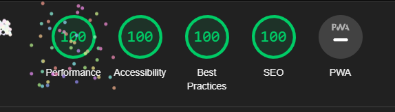

   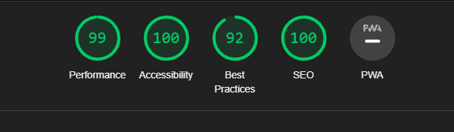

   - __The Sticker page lighthouse testing - desktop ~ mobile__

   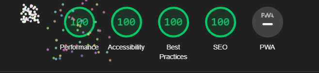

   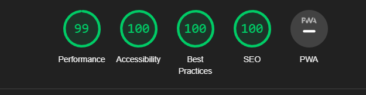

   - __The Contact page lighthouse testing - desktop ~ mobile__

   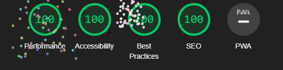

   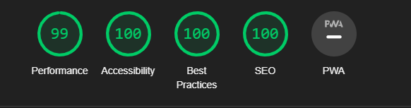

   - __The Thanks page lighthouse testing - desktop ~ mobile__

   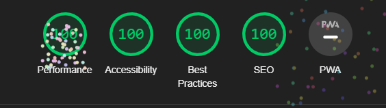

   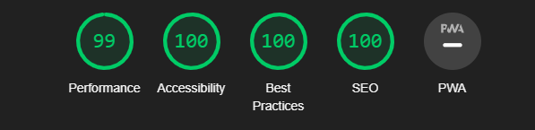

## __Deployment__

- __via gitpod__
    - Log into GitHub.
    - Make a repository
    - Click the green button close to the top of the page that says Gitpod.
    - After letting Gitpod load an alert pops up on the top of the screen, click cancel.
    - Then click the button that says More Actions.
    - Hereafter click Open in Browser.
    - Now right click with your mouse over the big box on the left that has your repository name over it.
    - Click new file.
    - Then make an index.html file. 
    - Go to the top of the index file and click ! and enter. This will make a start template.
    - Make a basic structure for your index page.
    - Click on terminal at the bottom of the page.
    - write 'git add .'
    - Then for your first commit write 'git commit -m "Initial commit".
    - Hereafter write 'git push'.
    - Your code have now been pushed back and saved on your GitHub repository.

  - __via GitHub pages__
    - Log into GitHub.
    - Go to the repositories.
    - Then take this project LunationDesign.
    - Go to the settings link.
    - Then click on the pages link that is found on the navigations bar on the left side.
    - Check the source section on the page, and choose main instead of none.
    - Then click Save. After a few minutes you can see your live GitHub pages site is now deployed and the URL shown at the top of the page.

## __Credits__

### Honourable mentions
- Tutor Assistance Sean.
- Tutor Assistance Gemma.
- Tutor Assistance Oisin.

### Content 
- All images, social media profiles, logo, and text have been made and written by me.
